# **Electrical Problems in Pernambuco**

The objective is to identify possible failures so that the service provider can be asked to implement improvements, guaranteeing the population of Pernambuco a quality service that efficiently meets the expectations of both the state government and citizens.

Therefore, ANEEL (National Electric Energy Agency), a special agency (regulatory agency) linked to the Ministry of Mines and Energy, was created to regulate the Brazilian electricity sector.

The public data provided by ANEEL, through the Sector Ombudsman's Office, refers to records of complaints made by consumers of the public electricity service throughout the country.

The Sector Ombudsman's Office acts as a direct institutional channel between society and ANEEL, especially in cases where consumers are unable to resolve their demands with the concessionaires.

Data source: https://dadosabertos.aneel.gov.br/dataset/ouvidoria-setorial-aneel

Data dictionary: https://dadosabertos.aneel.gov.br/dataset/1206d323-ad8c-46c6-bc2d-9b731e42ee26/resource/9b01f108-34c1-45d2-a8c9-0aeb19905257/download/dm-ouvidoriaaneel.pdf

### **Understanding Data**
For this study, data from the years 2022, 2023 and 2024 were used.

The aim was to compare Pernambuco with other states in the northeast and to delve deeper into the problems in Pernambuco.

Three types of classification are used in the data for different levels of granularity:
* Categories - Lower Granularity
* Subcategories - Medium Granularity
* Typologies - Higher Granularity

A typology may refer to different categories or subcategories, but the record is only linked to one of each type.

In other words, the typology of 'Power Outage' may be present as a category of 'Information' or 'Complaint', the user or citizen who classified this issue may have had different intentions in relation to the same problem, the power outage.

### **Exploratory Data Analysis**

Although Pernambuco (PE) in 2022 is in third place in terms of number of complaints, from 2023 onwards it surpasses the states of Bahia (BA) and Ceará (CE) with growth in 2024. While BA and CE show a decrease in 2024.

  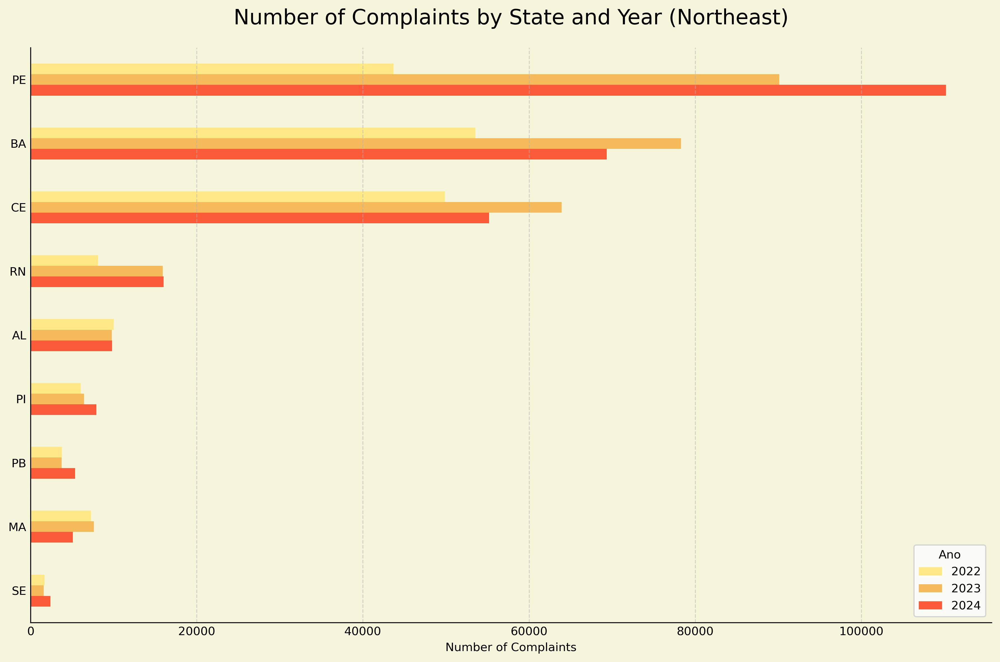

In the northeast, the lack of energy proved to be the main cause of complaints and with an increasing number between 2022 and 2024.

  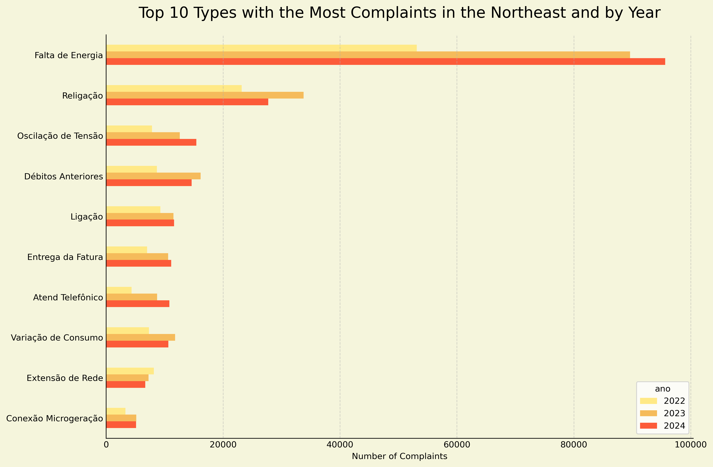

Lack of energy has shown to increase the number of complaints in Pernambuco in relation to other states. With a continuous increase in the number of complaints.

  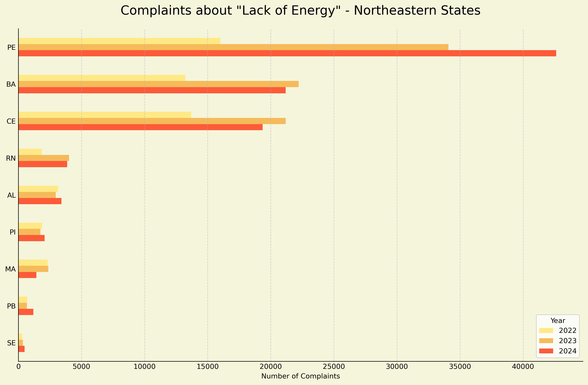

In Pernambuco, the lack of energy appears as the main type of complaint.

  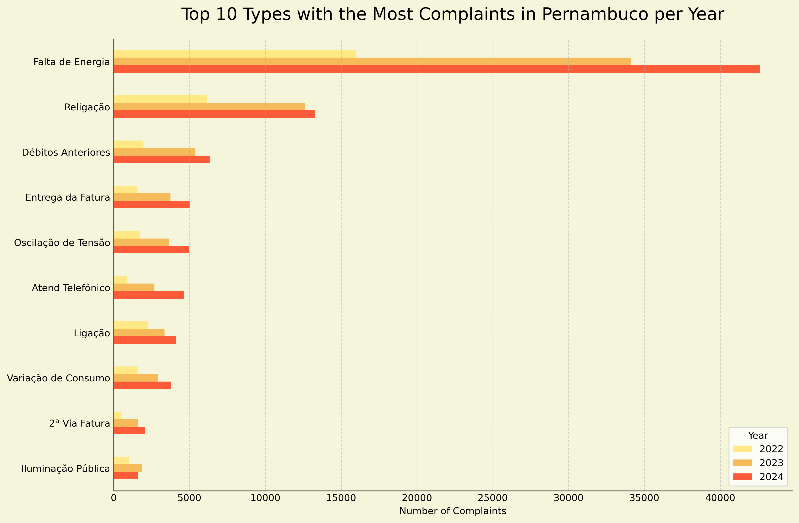

In Pernambuco, 2022 and 2023 showed a uniform pattern in the number of complaints due to lack of energy, although 2023 saw an increase compared to 2022.
However, it was in 2024 that the greatest discrepancy occurred in the first half of the year, especially in the first half of the year. Ending the year with a downward trend.

  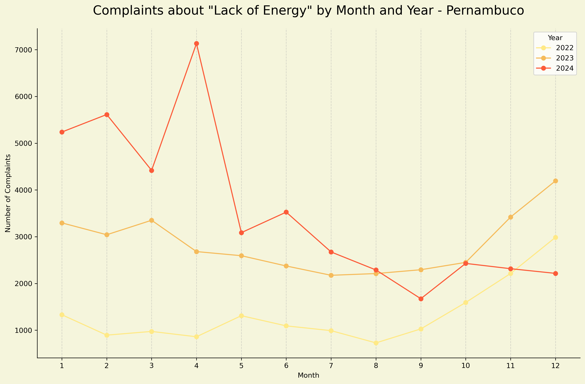

In turn, among the municipalities of Pernambuco, Recife (Capital) had the highest number of complaints about power outages.
However, this may be linked to the proportion of its population, which is the largest in the State.

  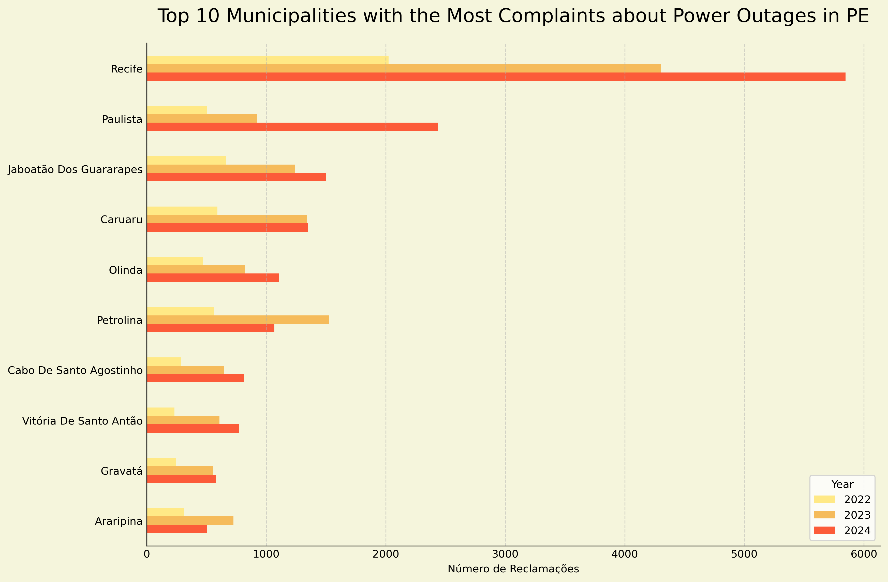

Recife presented a similar flow of complaints to that of Pernambuco, which, given the size of its population, indicates that the situation in Pernambuco mirrors to a certain extent what occurs in Recife.
A highlight is the month of May 2022 in Recife, which presents a different increase from what occurs in the state as a whole in the same year.

  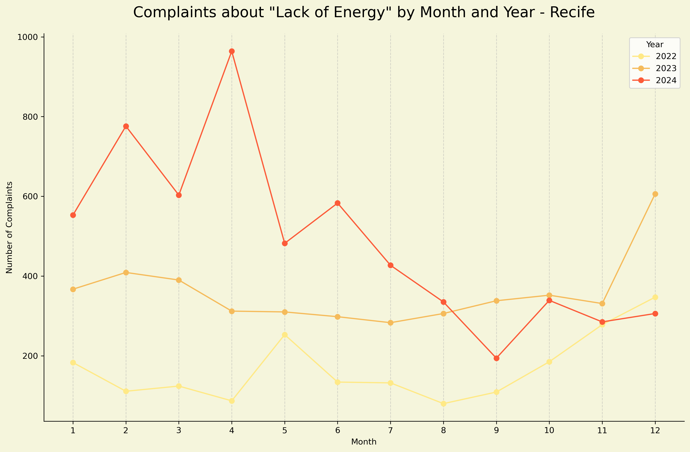

Although Recife is the most populous city and has the highest number of complaints about power outages, proportionally it does not even appear among the top 25 cities with the highest number of complaints per inhabitant.

  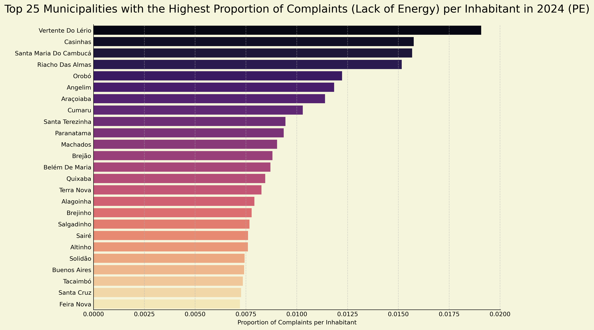

### **Anomaly Detection**
The **Local Outlier Factor (LOF)** is an anomaly (or outliers) detection algorithm.
It is especially useful when you want to identify points that behave differently from the rest of the data, considering the local context of their surroundings.
Based on other performance tests with the Isolation Forest and One-Class SVM models, LOF was deprecated since it showed a more conservative performance in identifying outliers.
 

Although some peaks occurred between 2022, it is at the end of 20233 and the first half of 2024 that there is the longest period with complaints about lack of energy that differ from the standard amount of complaints.

  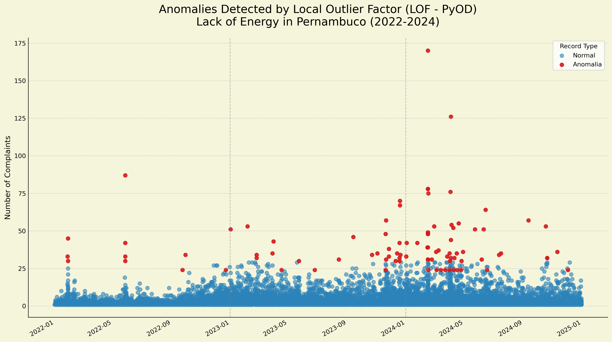

The first half of 2024 is the period with the highest number of complaints.

  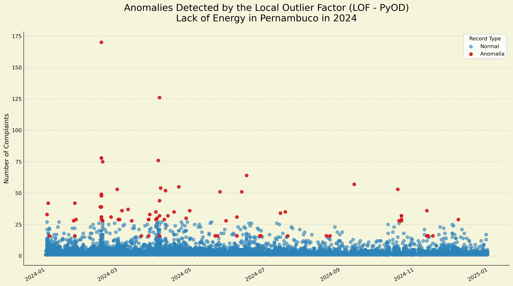

Therefore, Recife directly influences the perception of these distinct cases in Pernambuco.

  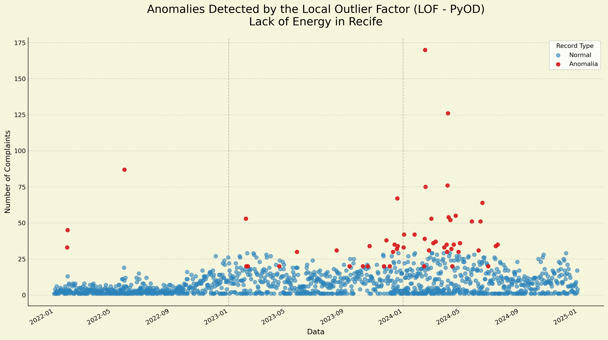

It was identified that the 'Lack of Energy' is the main challenge to be followed by the State Government.

Although Recife is the city with the largest number of complaints, proportionally there are still other smaller cities that present greater demand to ANEEL.

It is important to note that these are data from Complaints to ANEEL, there is the possibility of other occurrences that were not reported to the agency and there is the possibility that complaints were made exclusively to Neoenergia (electricity distribution company).

Also, it is important to highlight that the number of complaints may be linked to access to and dissemination of complaint channels.

  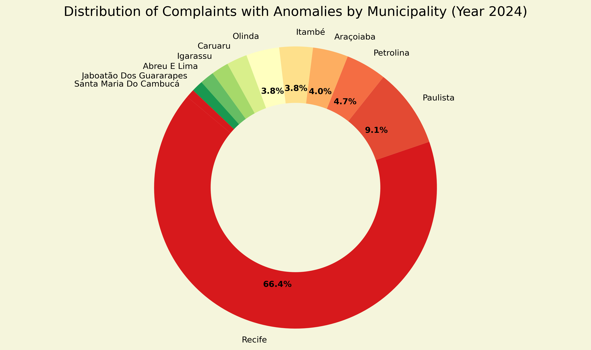

In 2024, the municipality of Recife accounted for more than half of the complaints or requests for information related to 'Lack of Energy' sent to ANEEL.

<!-- Possibilidades:
 - relação tamanho da cidade X quantidade de reclamação
 - comparar mais gráficos
 - gráfico de dispersão (scatter)

ponderar que o número de reclamações pode estar ligado com o acesso a canais de reclamação.
Pois a relação com a quantidade de reclamações pode estar ligada com divulgação eficiente de canais.
 -->